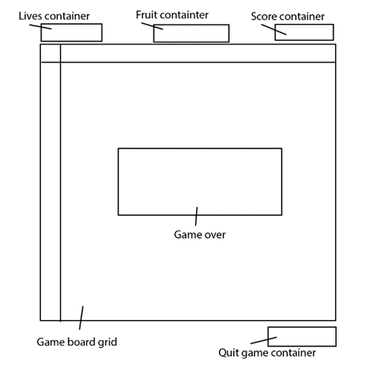
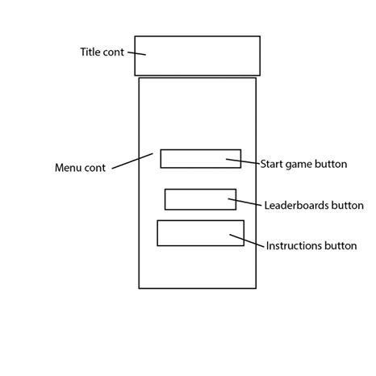
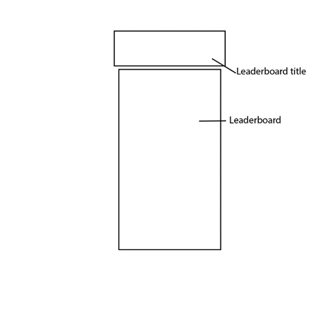
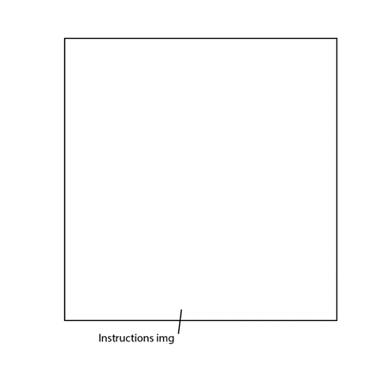
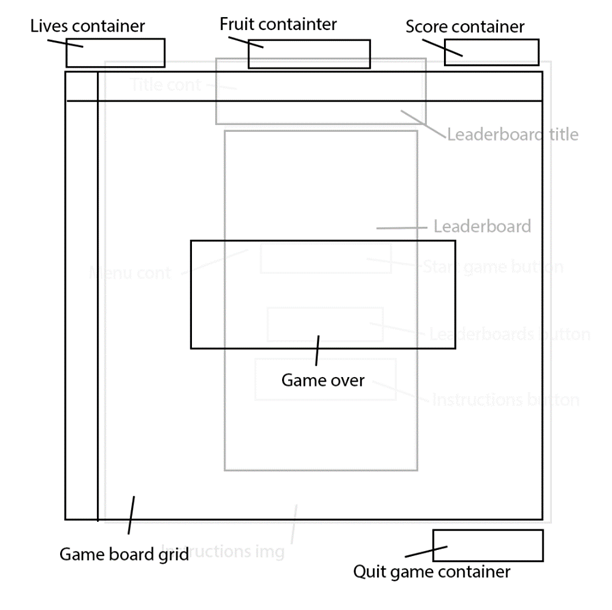

# Pacman

## Description

The purpose of this project was to create a functioning variant of an arcade game in JavaScript without using HTML canvas. This program is a recreation of Pac Man using only HTML, CSS and JavaScript.

## Deployment link

Please find the program at the following link: 
https://alfredshaw9.github.io/Pacman/

## Getting Started/Code Installation

This code is hosted and can be accessed using the deployment link above on GitHub. No additional steps are required to make use of the game other than following the link provided.

## Timeframe & Working Team

The timeframe of this code was 7 days, Friday the 3rd of November to the 10th. There was no collaboration done during this project. All work was carried out by me.

## Technologies Used

Technologies used are as follows:
<li>VS code</li>
<li>Photoshop</li>
<li>GitHub</li>
<li>Google Chrome</li>

## Brief

This project aims to emulate the mechanics of the Pac Man arcade game.
The player’s aim is to eat all the food in a maze while being chased by ghosts.
The player must be able to eat a special food to make the ghosts start flashing, and be able to capture them, sending them back to their holding pen from where they will start to hunt the player again.
The main aim is to achieve the highest possible score before being killed by the ghosts.

Requirements:
<li>The player should be able to clear at least one board of the game.</li>
<li>The player’s score should be displayed at the end of the game.</li>

Suggested enhancements:
<li>Responsive design.</li>
<li>Each board increases difficulty.</li>
<li>Persistent leaderboard using ‘Local storage’.</li>

## Planning

### Wireframe:

The first step in planning was generating a wireframe for the front end of the website. The wireframe consists of different “screens” that were represented by layers on photoshop. The frame was as follows:

The hierarchy of the planned display is shown in the last image, with the main game screen and the game over menu taking priority and displaying over the other windows.

### Pseudocode:

The scope for the game was planned out in Pseudocode. For structure, the pseudocode was also used to break down sections of the code and designate actions, functions, interactions, responses etc that would be required for the game to function. The pseudocode used in the planning process is as follows:

    // **Variables**

    //enemy 1 - 4 location

    //**functions**

    //menu visibility toggle
    //leaderboard visibility toggle
    //instructions visibility toggle
    /**The visibility toggle is simply a class that will set the ENTIRE div visibility
    This will also include the CSS pointer events property to solidify and stop any bugs happening */

    //Generate grid

    //Add layout of maze and items on grid
    /**hardcoded maze and item locations */

    //character reset
    /**resets the player position and stops the player movement running interval */

    //game reset
    /**resets the game values, called during each new game*/

    //Add / remove player
    /**place player at next movement area.*/

    //direction availability
    /**take player direction and location and finds next valid input */

    //player movement
    /**move player to new location based on previous location and available inputs */

    //Add ghosts to board
    /** */

    // class Ghost {
    //   constructor(startingPosition, cssClass) {
    //     this.startingPosition = startingPosition
    //     this.cssClass = cssClass
    //   }

    //   scared() {
    //     console.log('AAAHHHH')
    //   }
    // }

    // const redGhost = new Ghost(200, 'redGhost')
    // const blueGhost = new Ghost(25, 'blueGhost')

    // redGhost.scared()
    /**THIS IS MY CLASS DEMONSTRATION, need to get to grips with these... */

    //add fruit to board
    /**This will be an event that will occur after a timer. The location may be random or pre-determined */
    /**EXTRA EXTRA EXTRA */
    /**use a basic AI to make the fruit move randomly around the board */

    //player item pickup interaction
    /**remove pickup from board, add 10 to score for pellet.

    //player fruit pickup interaction
    /**add fruit to fruit div 
    for 1st fruit, add 100pts.
    for 2nd fruit, add 300pts.
    for 3rd fruit, add 500pts.
    for 4th fruit, add 700pts */
    /**EXTRA EXTRA EXTRA */
    /**add more fruits if I have time */

    //player enemy interaction

    /**INTERACTION 1
    IF player & enemy land on the same tile at a given point, we remove 1 life from player AND call board initialise.
    All values for score are to be left unchanged */

    /**INTERACTION 2
    IF enemy has switched states from the powerup, on player enemy collision, enemy will score is added.
    Reference variable that will check for correct state AND current amount of this kind of interaction.
    This interaction count will be wiped at the end of the duration of the state.
    For certain interaction counts, the score value will increase to a maximum.
    After interaction, ghost state is changed again */

    //Win game
    /**Check for all map pick up items and powerups to have been collected (excluding fruit)
    Will call initialise game AND add all powerups and pick up items again. */

    //Lose game
    /**Check logic for no lives left, get score and keep in local storage for leaderboard.
    Reset game but don’t start it. Bring up game over menu */

    //enemy AI behaviour 1 (chase)
    /**Possibility for unique ais for each ghost like real game
    Initial pathfinding is just path to player. Will implement 2 on fastest path and 2 on random path for functionality.
    /**EXTRA EXTRA EXTRA */
    /**Pathfinding takes locations based on player and other enemy location */

    //enemy AI behaviour 2 (roam)
    /**each ghost goes to a different roam location. AI takes concentration of player. */

    //enemy AI behaviour 3 (scared)
    /**use RNG to generate ghost behaviour. Travel direction will reverse the moment this is activated */

    //enemy AI behaviour 4 (eaten)
    /**head back to ghost box at speed. Fastest path to ghost box */

    //enemy movement

    //Condition logic for AIs to be active / inactive
    /**The longer the game goes on, the longer the AIs will stay on chase mode and the shorter they will go to roam.
    Top difficulty will be defined by player points held; this will cause chase mode to be on permanently. */

    //die animation

    //**Executions**

    //page load

    //**Events**

    //start game button

    //leaderboard button

    //instruction button

    //Movement input

    //pause game / reset button

    //lose game

## Build/Code Process

The main code is made up of four main sections. These are:

•	Variables
•	Functions
•	Executions
•	Events

The majority of functionality is contained inside the functions section. All global variables are defined at the beginning of the code in the variables section, and page load executions are contained in the executions section. Events contains event listeners for all buttons and keypresses required from the keyboard.

**The Map:**

The grid system used to build the game uses a line of divs that are shaped and scaled to create a usable grid. For Pac Man, I needed to create a maze that the player navigates through. To achieve this, I used an iterative loop to go through every div in the grid and assign it the correct class for the map. I made use of an array that had a matching number of elements in it to the main grid, and then assigned certain characters for the classes I wanted to add. This gives a visual representation of the map inside the code, adjusting easier and also allowing for a degree of modularity for adding in brand new maps by changing the map array.

The code:

    const map =
    [ '@', '@', '@', '@', '@', '@', '@', '@', '@', '@', '@', '@', '@', '@', '@', '@', '@', '@', '@',
      '@', '-', '-', '-', '-', '-', '-', '-', '-', '@', '-', '-', '-', '-', '-', '-', '-', '-', '@',
      '@', 'O', '@', '@', '-', '@', '@', '@', '-', '@', '-', '@', '@', '@', '-', '@', '@', 'O', '@',
      '@', '-', '@', '@', '-', '@', '@', '@', '-', '@', '-', '@', '@', '@', '-', '@', '@', '-', '@',
      '@', '-', '-', '-', '-', '-', '-', '-', '-', '-', '-', '-', '-', '-', '-', '-', '-', '-', '@',
      '@', '-', '@', '@', '-', '@', '-', '@', '@', '@', '@', '@', '-', '@', '-', '@', '@', '-', '@',
      '@', '-', '-', '-', '-', '@', '-', '-', '-', '@', '-', '-', '-', '@', '-', '-', '-', '-', '@',
      '@', '@', '@', '@', '-', '@', '@', '@', '-', '@', '-', '@', '@', '@', '-', '@', '@', '@', '@',
      '@', '@', '@', '@', '-', '@', '-', '-', '-', '-', '-', '-', '-', '@', '-', '@', '@', '@', '@',
      '@', '@', '@', '@', '-', '@', '-', '@', '@', '^', '@', '@', '-', '@', '-', '@', '@', '@', '@',
      '-', '-', '-', '-', '-', '-', '-', '@', 'G', 'G', 'G', '@', '-', '-', '-', '-', '-', '-', '-',
      '@', '@', '@', '@', '-', '@', '-', '@', '@', '@', '@', '@', '-', '@', '-', '@', '@', '@', '@',
      '@', '@', '@', '@', '-', '@', '-', '-', '-', 'P', '-', '-', '-', '@', '-', '@', '@', '@', '@',
      '@', '@', '@', '@', '-', '@', '-', '@', '@', '@', '@', '@', '-', '@', '-', '@', '@', '@', '@',
      '@', '-', '-', '-', '-', '-', '-', '-', '-', '@', '-', '-', '-', '-', '-', '-', '-', '-', '@',
      '@', '-', '@', '@', '-', '@', '@', '@', '-', '@', '-', '@', '@', '@', '-', '@', '@', '-', '@',
      '@', 'O', '-', '@', '-', '-', '-', '-', '-', '-', '-', '-', '-', '-', '-', '@', '-', 'O', '@',
      '@', '@', '-', '@', '-', '@', '-', '@', '@', '@', '@', '@', '-', '@', '-', '@', '-', '@', '@',
      '@', '-', '-', '-', '-', '@', '-', '-', '-', '@', '-', '-', '-', '@', '-', '-', '-', '-', '@',
      '@', '-', '@', '@', '@', '@', '@', '@', '-', '@', '-', '@', '@', '@', '@', '@', '@', '-', '@',
      '@', '-', '-', '-', '-', '-', '-', '-', '-', '-', '-', '-', '-', '-', '-', '-', '-', '-', '@',
      '@', '@', '@', '@', '@', '@', '@', '@', '@', '@', '@', '@', '@', '@', '@', '@', '@', '@', '@' ]

    //Add layout of maze and items on grid
    /**hardcoded maze and item locations */
    function placeItems() {
      for (let i = 1; i <= cellCount; i++) {
        const cell = document.querySelector(`.gameBoard div:nth-of-type(${i})`)
        const mapDef = map[i - 1]
        if (mapDef === '@') {
          cell.classList.add('wall')
        } else if (mapDef === '^') {
          cell.classList.add('ghostWall')
          cell.classList.add('wall')
        } else if (mapDef === '-') {
          cell.classList.add('pellet')
          pickupTarget += 1
        } else if (mapDef === 'O') {
          cell.classList.add('powerUp')
          pickupTarget += 1
        }
      }
    }

The function maps walls, the ghost wall, the pellets and the powerup for the map, so this code takes care of the entire board setup.

**The main running interval:**

For my game to function like Pac Man, I decided that I would create a constant running interval function. This function would keep running and move both the player and ghosts around the board at an interval to simulate the original game. To do this, all my main functions had to be contained inside one main interval, such as player movement input, animation changes, entity movement, collision detection etc.

The code:

    //start game
    function startGame() {
      plDir = 'left'
      ghDir.Red = 'left'

      ghToggle.Red = false
      ghToggle.Blue = false
      ghToggle.Pink = false
      ghToggle.Orange = false
      
      rdy()

      redSpn = setTimeout(function() {
        ghToggle.Red = true
      }, 4000)

      blueSpn = setTimeout(function() {
        ghToggle.Blue = true
      }, 6000)

      pinkSpn = setTimeout(function() {
        ghToggle.Pink = true
      }, 10000)

      orngSpn = setTimeout(function() {
        ghToggle.Orange = true
      }, 14000)

      setTimeout(function() {

        showQuitBtn()

        moveTimer = setInterval(function() {

          ghostTarget = {
            Red: currentPos,
            Blue: currentPos - 4 * width,
            Pink: currentPos + 4,
            Orange: currentPos + 4 * width,
          }

          scaredToggleChk()
          pickupChk('powerUp', 50)
          pickupChk('pellet', 10)

          if (ghToggle.Red === true) {
            addGhost('Red')
            cells[180].classList.remove('gMvLeftRed')

            setTimeout(function() {
              getPath('Red', ghostTarget.Red)
              ghostMoveDecide('Red')
              ghostMove('Red')
            }, 100)
          } else if (ghToggle.Red === false) {
            removeGhost('Red')
            cells[180].classList.add('gMvLeftRed')
          }

          if (ghToggle.Blue === true) {
            addGhost('Blue')
            cells[198].classList.remove('gMvLeftBlue')

            setTimeout(function() {
              getPath('Blue', ghostTarget.Blue)
              ghostMoveDecide('Blue')
              ghostMove('Blue')
            }, 100)
          } else if (ghToggle.Blue === false) {
            removeGhost('Blue')
            cells[198].classList.add('gMvLeftBlue')
          }
            
          if (ghToggle.Pink === true) {
            addGhost('Pink')
            cells[200].classList.remove('gMvLeftPink')

            setTimeout(function() {
              getPath('Pink', ghostTarget.Pink)
              ghostMoveDecide('Pink')
              ghostMove('Pink')
            }, 100)
          } else if (ghToggle.Pink === false) {
            removeGhost('Pink')
            cells[200].classList.add('gMvLeftPink')
          }
            
          if (ghToggle.Orange === true) {
            addGhost('Orange')
            cells[199].classList.remove('gMvLeftOrange')

            setTimeout(function() {
              getPath('Orange', ghostTarget.Orange)       
              ghostMoveDecide('Orange')
              ghostMove('Orange')
            }, 100)
          } else if (ghToggle.Orange === false) {
            removeGhost('Orange')
            cells[199].classList.add('gMvLeftOrange')
          }

          playerMove()
          scoreUpdater()
          setTimeout(function() {
            ghostHitChk()
          }, 250)

          ghostTargetVld('Red')
          ghostTargetVld('Blue')
          ghostTargetVld('Pink')
          ghostTargetVld('Orange')

        }, 300)
      }, 2000)
    }

This function's intention was to be called every time the player loses a life, so the start of it has timeout functions to release the ghosts from their ghost house. Under here we see the set interval timer for the main game control. We can see each ghost has their individual functions for movement, path generation, movement validation etc. Additionally, there is a conditional for when the ghost is not present on the board (eaten state or not spawned in).
The player has a function for movement, and then collisions are taken care of with a check function. Other functions are integrated here for functionality, such as a score updater, quit button toggle, and scared state toggle. This block is the running game's main functionality.

**The path finding:**

A very important section of Pac Man is how the ghost behaves. I decided to have a go at creating a more intelligent appearing AI for my game. To do this I researched several different pathfinding theories and then decided to create a simplified one that fits my needs. I decided on a variant of something called the A* algorithm, that uses steps taken, distance from target and a memory system for creating a path to a known target.
My modifications of this algorithm basically ignore the backtracking capabilities and only use the memory and distance from target systems to generate a path.
The logic is as follows:

1.	Find target locations coordinates and starting location coordinates.
2.	Find all surrounding movements that can be taken (up down left or right.)
3.	If a movement is inaccessible (a wall or previous movement), assign a value of infinity.
4.	If a movement is accessible, calculate the directional vector from that new square to the target square.
5.	Evaluate all the accessible directional vector values and find the lowest one.
6.	Select this to move to.
7.	Log the previous location that you have just moved from for reference for path gen.

Following this logic, with no dead ends available in the maze, a path can always be generated. An additional section of code is added to end the path once it hits itself (though again another memory log). This section of code stops an infinite path from being generated if the target is on an inaccessible tile. This algorithm also allows for some more dynamic control of ghosts, by changing their target tile to be at different locations, resulting in different appearing ghost behaviour. The hardcoded targets can be seen above in the main game loop code. As they are variables, they can also be changed (like with the target validation function) or by another timed function for difficulty.

The code:

    //Main Pathfinding AI
    let pathHist = []
    let pathComplete = false

    function pathStepGen(color, target) {

      const finish = target

      function hscore(dir) {
        const dirloc = cells[dir].getBoundingClientRect()
        const endloc = cells[finish].getBoundingClientRect()
        const hscoreVal = Math.sqrt(Math.pow((endloc.x - dirloc.x),2) + Math.pow((endloc.y - dirloc.y),2))
        return hscoreVal
      }

      function fscoreCalc(dir) {
        let fscoredir
        if ( -1 > dir || dir > cellCount || cells[dir].classList.contains('wall') || dir === lastMv[color] || pathHist.includes(dir)) {
          fscoredir = Infinity
        } else {
          fscoredir = hscore(dir)
        }
        return fscoredir
      }

      const up = current - width
      const down = current + width
      const left = current - 1
      const right = current + 1
      const fscoreUp = fscoreCalc(up)
      const fscoreDown = fscoreCalc(down)
      const fscoreLeft = fscoreCalc(left)
      const fscoreRight = fscoreCalc(right)

      let ans

      ans = Math.min(fscoreUp, fscoreDown, fscoreLeft, fscoreRight)

      if (scaredTimer === true) {
        const dirs = []
        if (fscoreUp !== Infinity) dirs.push(fscoreUp)
        if (fscoreDown !== Infinity) dirs.push(fscoreDown)
        if (fscoreLeft !== Infinity) dirs.push(fscoreLeft)
        if (fscoreRight !== Infinity) dirs.push(fscoreRight)
        const choose = Math.floor(Math.random() * dirs.length)
        ans = dirs[choose]
      }

      pathHist.push(current)
      
      if (pathHist[0] === finish){
        pathHist = []
        pathHist.push(-200, lastMv[color])
        return pathHist
      } else if (pathHist && current === finish || ans === Infinity) {
        lastMv[color] = pathHist[0]
        pathComplete = true
        return pathHist
      } else if (scaredTimer === true && pathHist.length === 3) {
        lastMv[color] = pathHist[0]
        pathComplete = true
        return pathHist
      }

      if (fscoreUp === ans) current = up
      if (fscoreDown === ans) current = down
      if (fscoreLeft === ans) current = left
      if (fscoreRight === ans) current = right

    }

    function getPath(color, target) {
      current = ghostPos[color]
      while (!pathComplete) {
        ghostPath[color] = pathStepGen(color, target)
      }
      pathHist = []
      pathComplete = false
    }

This algorithm uses a hscore variable to store the vector values of the tile locations. This name was lifted from the A* algorithm but is just a direct vector. The conditional statements near the bottom of the code control the path generation for when the ghost is right on the player and the path length is zero, when there are no available areas for the ghost to move into and when the ghosts are in a sacred state. (A bug is present here. It is explained at the end of the readme in the bugs section, but this code is known to be functional.)

## Challenges

During this project, the biggest challenge was making the game function using set intervals in JavaScript. The game's main running loop was in a single set interval function to simulate the constant runtime of Pac Man. This created problems with speed, directions, timing, placements etc as functions were all waiting on an interval to be carried out. This is the cause of a few bugs still left in the game. This challenge was tackled by systematically testing most of the sections of code in isolation and creating functions for the main actions that were to be carried out. This approach allowed most of the game's standard functions to work seamlessly together but made checks on certain parts of the game a lot harder.

The other challenge faced was pathfinding for the Ais in the game. The pathfinding was planned to be more basic and simply move the ghosts towards the targets or at random. Because of this, I started with research on pathfinding for the Ais early and generated a few different approaches to the problem. I found a few tutorials and read about several pathfinding methods before settling on a variation of the A* algorithm to generate a path. These used vectors based on location to generate movement data. This created another challenge, as the algorithm was now generating paths that would be used and stored very quickly, so I decided to separate the algorithm into a separate document and create a visual representation of it functioning to validate it. This made the process of creating and generating the algorithm very simple. It was then integrated into my main code through a function in the time interval.

## Wins

My biggest win was my pathfinding algorithm. As described above, the algorithm was taken and generated outside of the main game first, which allowed me to gain a lot of insight into how to program and streamline variable functions with lots of functionality in them like this.

Following this, I was very proud of the animations and the menus in the program. Here I was able to use JavaScript and classes to create animations based on direction for both the ghosts and player, which helps make the game seem more alive and active as the movement unfortunately is limited to moving one grid position at a time with no smooth transition. The timing was important for the animations as it allows ready screens and death animations etc to play out.

Additionally with the heavy use of set interval functions, I believe I now have a decent understanding of them and can start to more effectively apply them in programs. This project showed me that they have limitations, but I now feel very confident using them.

## Key Learnings/Takeaways

I learnt a lot about what information JavaScript and get from a web page, specifically coordinates. My pathfinding algorithm was designed to work with a bit of maths and then a lot of conditional logic, but it required the use of a vector from one point to another. The inbuild coordinate system allowed me to trip down my code and showed me other data I can pull from an element relative to the page.

I also learnt that set interval loops in JavaScript are more effective when they are lighter. I had one controlling set interval that caused some small functionality issues in the code, which I believe could have been rectified if I had split the set intervals up into different functions that were all called at a similar time. This would have caused more complex refresh functions that would be resetting multiple intervals but may have allowed for easier bug fixing and more complex functions to be introduced without creating more bugs.

## Bugs

1.	Ghost and player collisions sometimes will not happen. This is due to the set interval function controlling the entire game loop. This bug occurs because the player and the ghost movement are all set inside one large set interval loop, so if you have a ghost in the cell before you that is coming towards you, when they make their move, and you make yours, you will switch squares. The move checker will then not see a collision between the player and ghost as they were never on the same square.
2.	Due to the targeting system in the ghosts. If they are being chased in normal mode (which can happen as I did not create a dynamic targeting system due to time restraints), in certain map areas they can generate a path that will go out of bounds for a single move. This is corrected afterwards but I believe is due to my conditional code that will create different path generation behaviour if the path gets too short.
3.	During chase mode when the ghosts’ states have changed, their movement is unfortunately random. The code is programmed to allow them to follow more intricate pathfinding that uses random generation at points where they have an option of where to move (intersections at corridors), but I needed to slow them down to allow the player to easily catch them. For this, I needed to create a blank movement input during the game's main set interval timer to allow them to move at half speed. This removes the one step movement memory that is used to force ghosts to only move forwards, resulting in the movement being random and allowing the ghosts to change direction. This could possibly be rectified by a new memory variable, but time did not allow for this project.

## Future Improvements

<li>Fixing all bugs, possibly rethinking the set interval moment system for this.</li>
<li>Integration of sounds into games to enhance feel and experience.</li>
<li>Integration of a leaderboard system to the game to show local scores.</li>
<li>Addition of the fruits from the original game for added score opportunities.</li>
<li>Dynamic pathfinding for the Ais by using more timers linked to the target variable on them to allow them to appear more intelligent with their tracking.</li>
<li>Addition of a difficulty system that can reference the dynamic pathfinding to make the ghosts seek the player more frequently or scatter and roam more often etc.</li>

